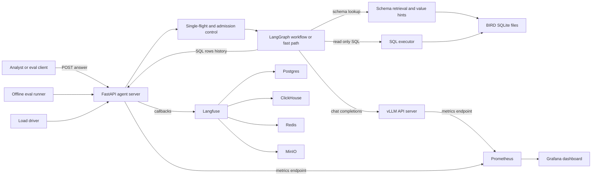
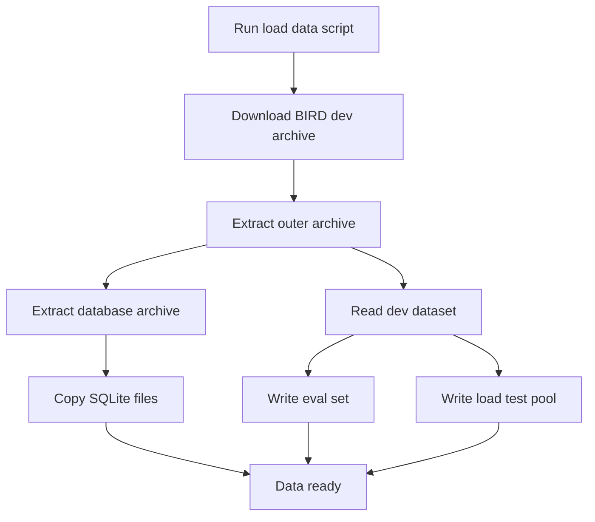
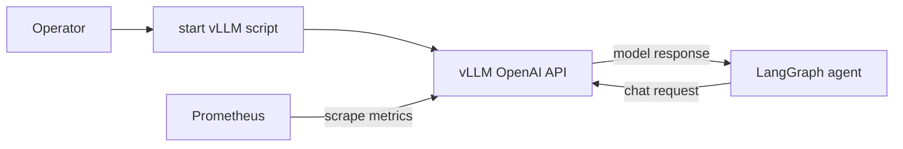
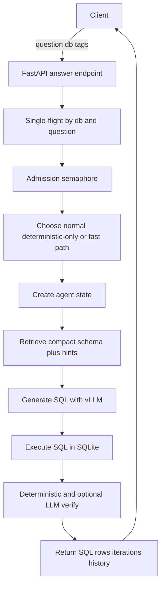
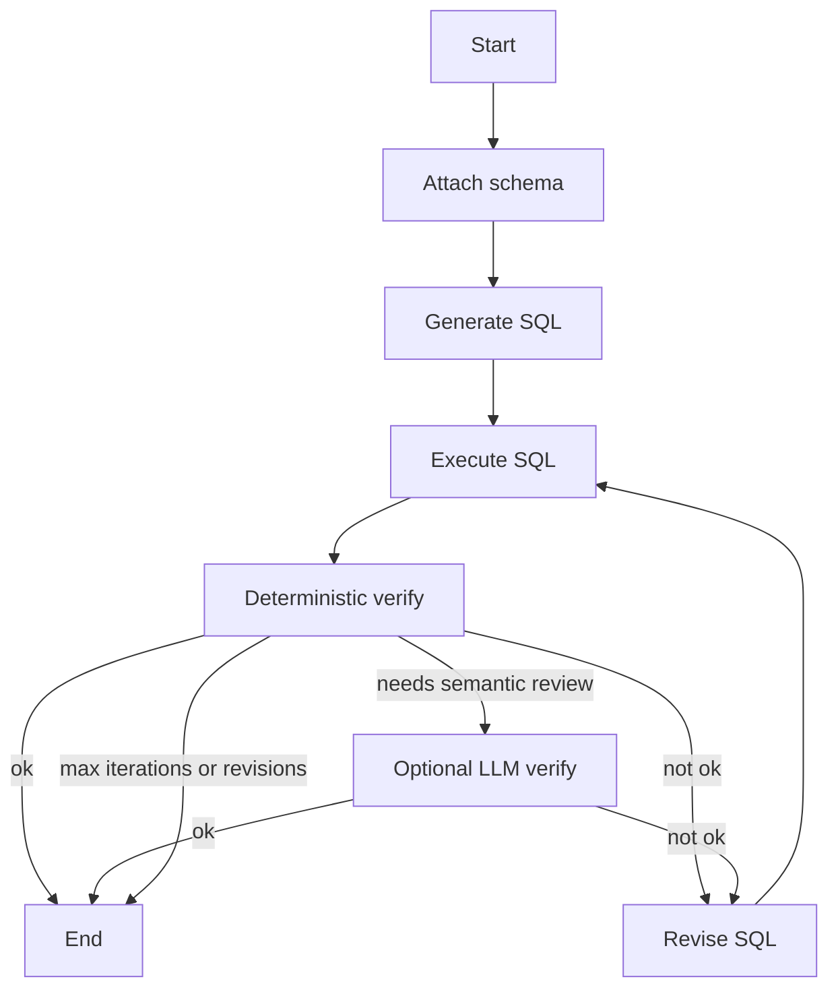
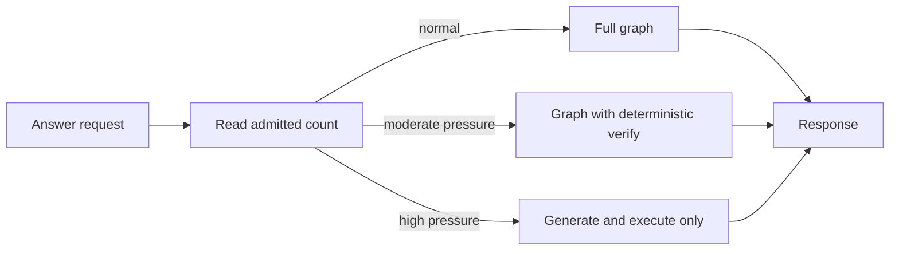
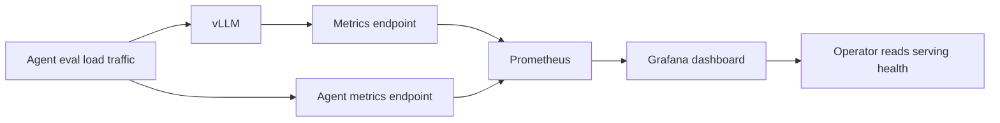
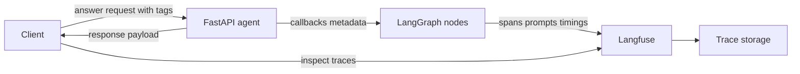
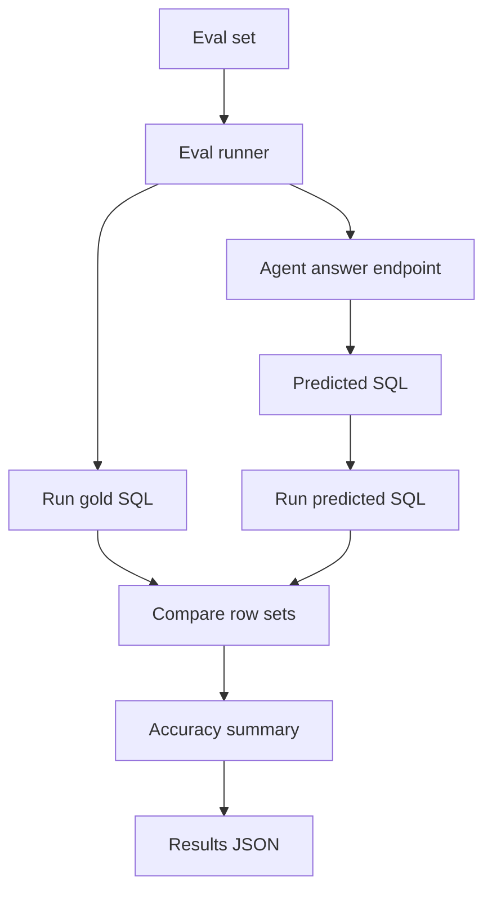
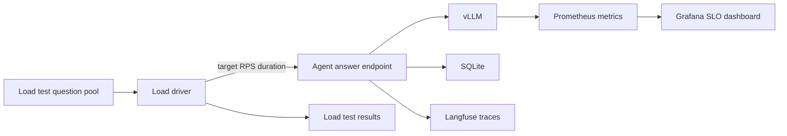

# Architecture

This repository is a self-hosted text-to-SQL MLOps assignment. It combines a vLLM OpenAI-compatible endpoint, a LangGraph agent, SQLite BIRD databases, Prometheus and Grafana serving observability, Langfuse tracing, offline evals, and a load driver for SLO testing.

The assignment scaffolding has been filled in. `agent/graph.py`, `agent/prompts.py`, and `evals/run_eval.py` contain the implemented agent and eval runner used for the reported results.

The diagrams below intentionally use a conservative Mermaid subset for VS Code preview compatibility: only `flowchart`, quoted node labels, short edge labels, and no HTML line breaks.

## Main High-Level Diagram

## Use Case: Load BIRD Data

`scripts/load_data.py` downloads the BIRD dev archive, extracts the databases, surfaces each SQLite file under `data/bird/`, and writes the curated eval and load-test inputs.

## Use Case: Serve the Model

`scripts/start_vllm.sh` starts vLLM on port `8000` with `Qwen/Qwen3-30B-A3B-Instruct-2507`. The agent talks to it through `langchain-openai` using `VLLM_BASE_URL`, `VLLM_MODEL`, and `OPENAI_API_KEY`.

## Use Case: Answer a Text-to-SQL Request

The runtime path starts at `POST /answer`. The server coalesces identical in-flight `(db, normalized question)` requests when `AGENT_SINGLEFLIGHT=true`, admits work through an in-flight semaphore, and runs blocking graph work in an explicit executor. Under adaptive pressure it can switch from normal graph mode to deterministic-only verification or to the fast path. The response returns the final SQL, rows, iteration count, status, and history.

## Use Case: Verify and Revise SQL

The full graph is a self-correction loop. `generate_sql` and each `revise` increment `iteration`; the router stops when verification succeeds, `AGENT_MAX_ITERATIONS` is reached, or `AGENT_MAX_REVISIONS` is exhausted. Verification is deterministic first: execution errors, zero-row non-aggregate answers, NULL aggregate results, aggregate-shape mismatches, suspicious projection choices, and broad/ranking queries can be rejected without another LLM call. If `AGENT_SEMANTIC_LLM_VERIFY=true` and conditional rules request it, a verifier model reviews a compact SQL-touched schema slice plus execution metadata. In fast-path mode the agent skips verify/revise and returns `generate_sql -> execute` for latency.

## Use Case: Fast Path and Adaptive Pressure

For the Phase 6 SLO, `agent/server.py` supports a lower-latency path controlled by `AGENT_FAST_PATH` or adaptive pressure metadata. `AGENT_ADAPTIVE_PRESSURE=true` moves admitted requests into `deterministic_only` mode at `AGENT_DETERMINISTIC_ONLY_AT` and into `fast_path` mode at `AGENT_PRESSURE_FAST_PATH_AT`. This protects tail latency under load, with the quality tradeoff documented in `REPORT.md`.

## Use Case: Observe Serving Health

Prometheus scrapes vLLM's `/metrics` endpoint through `host.docker.internal:8000` and the agent server's `/metrics` endpoint on port `8001`. Grafana loads the Prometheus datasource and serving dashboard from `infra/grafana/provisioning`.

## Use Case: Trace Agent Runs

When `LANGFUSE_PUBLIC_KEY` and `LANGFUSE_SECRET_KEY` are present, `agent/server.py` attaches the Langfuse callback handler to each graph invocation. Request `tags` are passed as metadata and also converted to trace tags; the server adds the adaptive mode tag as well.

## Use Case: Run Offline Evals

The eval runner calls the agent for every curated question, executes both predicted and gold SQL against the same SQLite database, canonicalizes row sets, and writes a JSON report under `results/`.

## Use Case: Run Load and SLO Tests

The load driver samples questions from `load_test/perf_pool.jsonl`, sends them to the agent endpoint at a requested RPS, and writes latency and status summaries to `results/load_test.json` or the path passed with `--out`. The same traffic exercises vLLM metrics and the agent Prometheus metrics; Langfuse traces are available when tracing keys are configured, but can be disabled for high-load SLO runs to avoid callback overhead.

