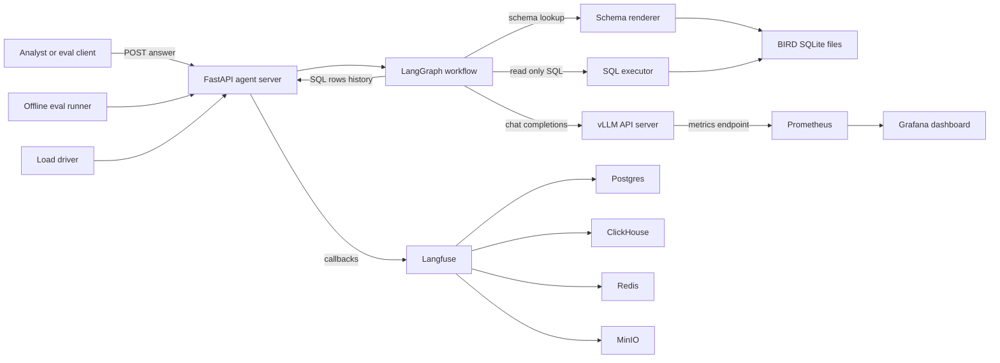
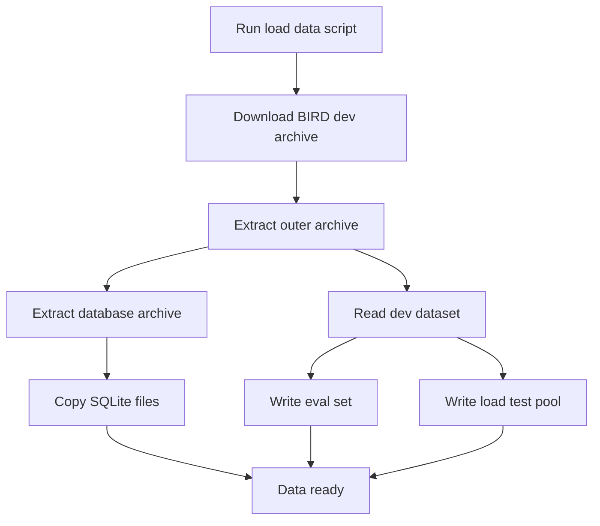
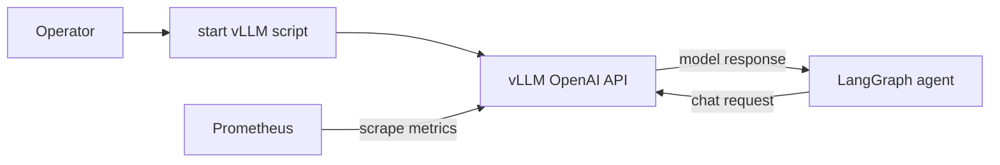
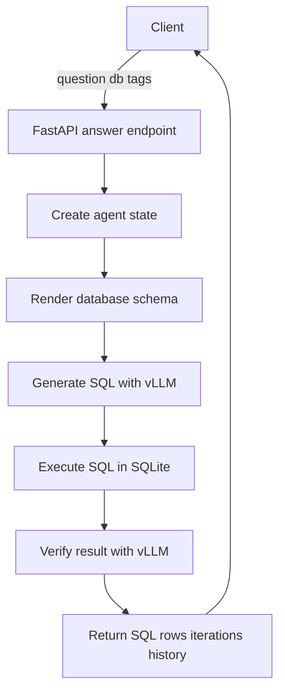
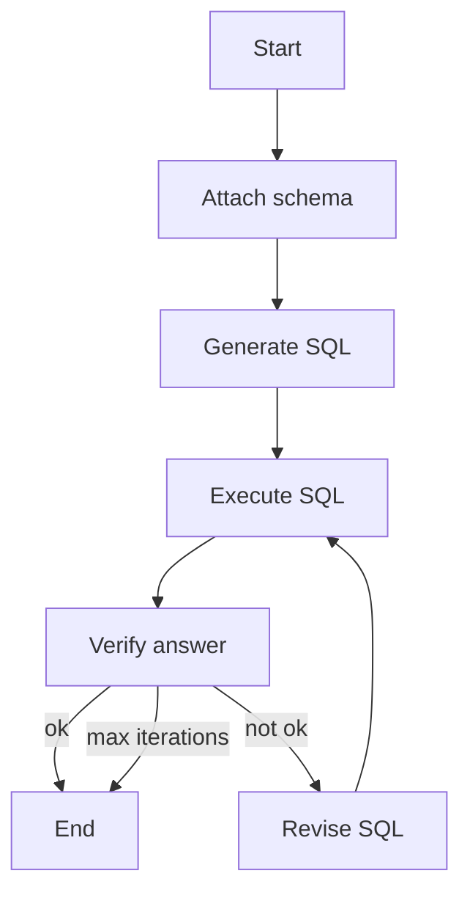
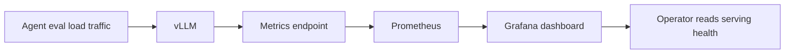
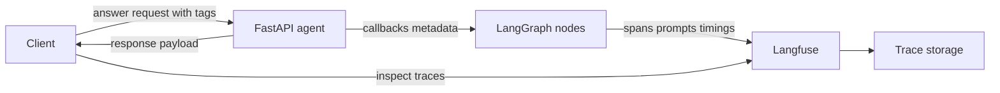
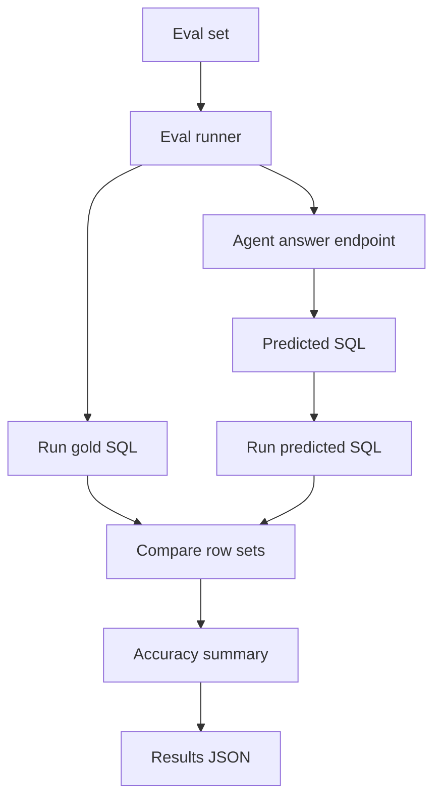
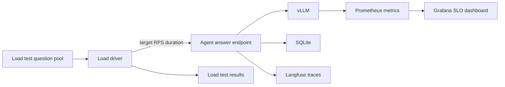

# Architecture

This repository is a self-hosted text-to-SQL MLOps assignment. It combines a vLLM OpenAI-compatible endpoint, a LangGraph agent, SQLite BIRD databases, Prometheus and Grafana serving observability, Langfuse tracing, offline evals, and a load driver for SLO testing.

Some files are intentionally scaffolded for the assignment. In particular, `agent/graph.py`, `agent/prompts.py`, and `evals/run_eval.py` contain implementation points for later phases.

The diagrams below intentionally use a conservative Mermaid subset for VS Code preview compatibility: only `flowchart`, quoted node labels, short edge labels, and no HTML line breaks.

## Main High-Level Diagram

## Use Case: Load BIRD Data

`scripts/load_data.py` downloads the BIRD dev archive, extracts the databases, surfaces each SQLite file under `data/bird/`, and writes the curated eval and load-test inputs.

## Use Case: Serve the Model

`scripts/start_vllm.sh` starts vLLM on port `8000` with `Qwen/Qwen3-30B-A3B-Instruct-2507`. The agent talks to it through `langchain-openai` using `VLLM_BASE_URL`, `VLLM_MODEL`, and `OPENAI_API_KEY`.

## Use Case: Answer a Text-to-SQL Request

The runtime path starts at `POST /answer`. The server invokes the LangGraph workflow and returns the final SQL, rows, iteration count, status, and history.

## Use Case: Verify and Revise SQL

The graph is designed as a self-correction loop. `generate_sql` and each `revise` increment `iteration`; the router stops when verification succeeds or the max iteration cap is reached.

## Use Case: Observe vLLM Serving Health

Prometheus scrapes vLLM's `/metrics` endpoint through `host.docker.internal:8000`. Grafana loads the Prometheus datasource and starter serving dashboard from `infra/grafana/provisioning`.

## Use Case: Trace Agent Runs

When `LANGFUSE_PUBLIC_KEY` and `LANGFUSE_SECRET_KEY` are present, `agent/server.py` attaches the Langfuse callback handler to each graph invocation. Request `tags` are passed as metadata.

## Use Case: Run Offline Evals

The eval runner calls the agent for every curated question, executes both predicted and gold SQL against the same SQLite database, canonicalizes row sets, and writes a JSON report under `results/`.

## Use Case: Run Load and SLO Tests

The load driver samples questions from `load_test/perf_pool.jsonl`, sends them to the agent endpoint at a requested RPS, and writes latency and status summaries to `results/load_test.json`. The same traffic exercises vLLM metrics and Langfuse traces.

